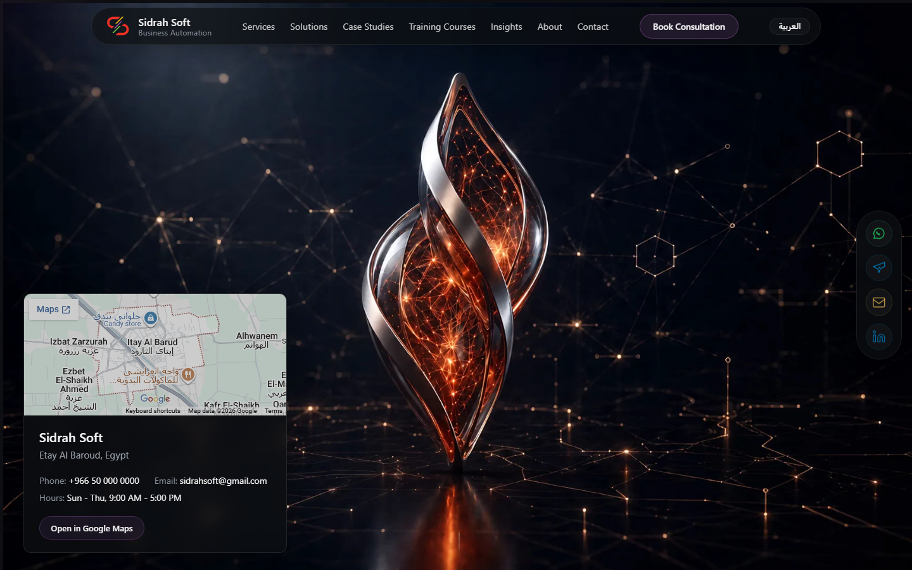
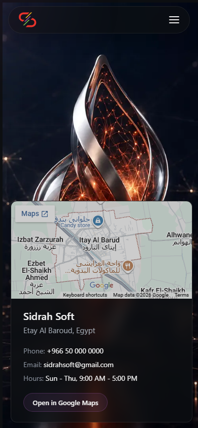

# HERO-MAP-RELOCATION-AND-BLACK-SCREEN-FIX-001 — Report

- **Date:** 2026-07-11
- **Scope:** Fix the black-screen runtime error and relocate the company location card from the Contact section into the Hero section.
- **Report path:** `project-memory/evidence/HERO-MAP-RELOCATION-AND-BLACK-SCREEN-FIX-001-REPORT.md`

## Final Status

- **Black-screen fix:** PASS
- **Location card relocation:** PASS
- **Google Maps destination update:** PASS
- **Build:** PASS (`npm run build` exits 0)
- **Browser validation (task scope):** PASS
- **Overall horizontal overflow:** Pre-existing marquee overflow detected at 390 px mobile viewport (unrelated to this change)

## Root Cause of the Black Screen

React threw a runtime `ReferenceError` during render because `CareersPage` was used in `src/App.jsx` but never imported. The entire component tree crashed before any content could be painted, leaving the screen black.

Browser console error:

```
[PAGEERROR] CareersPage is not defined
An error occurred in the <App> component. Consider adding an error boundary...
```

Responsible file/line:

- `src/App.jsx:63` — `<Route path="/careers" element={<CareersPage />} />`

## Files Modified

1. `src/App.jsx`
   - Added missing `import CareersPage from './pages/CareersPage';`
2. `src/components/sections/ContactSection.jsx`
   - Removed `<CompanyLocationCard />` and its import.
3. `src/components/hero/CinematicHero.jsx`
   - Imported `CompanyLocationCard` and rendered it inside a dedicated `.hero-location-wrapper` / `.hero-location-panel` inside the sticky Hero canvas wrapper.
4. `src/components/location/CompanyLocationCard.jsx`
   - Added bilingual address support via `useI18n` + `getBilingual`.
   - Made the map overlay a clickable button that opens the configured Google Maps URL in a new tab.
5. `src/components/Footer.jsx`
   - Updated footer address rendering to use `getBilingual` so it continues to work after the fallback address became a bilingual object.
6. `src/data/company/companyLocation.js`
   - Changed fallback address to bilingual `Etay Al Baroud, Egypt` / `إيتاي البارود، مصر`.
   - Set `googleMapsUrl` to the exact requested Google Maps destination.
   - Set `mapEmbedUrl` to `https://www.google.com/maps?q=etay+al+baroud&output=embed`.
7. `src/styles/global.css`
   - Added `.hero-location-wrapper`, `.hero-location-panel`, and responsive Hero overrides for the location card.
   - Added `.company-location-map-overlay--clickable` styles.
   - Changed `width: 100vw` to `width: 100%` on `.cinematic-canvas-wrapper` and `.interactive-network-background` to avoid scrollbar-induced horizontal overflow.

## Black-Screen Fix

```jsx
// src/App.jsx
import CareersPage from './pages/CareersPage';
```

After this import, `/`, `/careers`, `/cms/login`, and `/cms` render without the `CareersPage is not defined` runtime error.

## Hero Location Result

The existing `CompanyLocationCard` is now reused inside the Hero as a premium, semi-transparent floating panel.

### Desktop behavior

- Positioned in the lower-left of the Hero viewport.
- Width constrained to `26rem` (~416 px).
- Does not cover the central cinematic artifact.
- Glass/dark surface with subtle border, backdrop blur, and soft shadow.
- Map overlay is clickable and opens the supplied Google Maps URL.



### Mobile behavior

- Card switches to a bottom-anchored, full-width minus padding layout at ≤ 767 px.
- Remains inside the sticky Hero viewport.
- No overlap caused by the location card itself; the card stays within the viewport.
- Touch-friendly spacing and readable text.



## Contact Section Result

The location card has been removed from the Contact section. The contact form and other public contact information remain intact.

```jsx
// Removed from src/components/sections/ContactSection.jsx
<CompanyLocationCard />
```

## Build Result

```
npm run build
Exit code: 0
```

The production build completes successfully.

## Browser Console Result

No runtime errors were recorded after the fix. The only console messages were expected CORS/network failures because the Django backend was not running during the lightweight frontend validation.

Key checks:

- Home page renders: `true`
- Hero location card renders: `true`
- CareersPage runtime error: `false`
- `/careers` renders: `true`
- `/cms/login` renders without error: `true`
- Contact section still has location card: `false`
- Hero Google Maps link targets Etay Al Baroud: `true`
- Mobile Hero renders: `true`
- Mobile Hero location card renders: `true`
- Mobile overflow caused by hero/location card: `false`

## Hero Animation Compatibility

- GSAP ScrollTrigger and canvas frame sequencing remain intact.
- The location card wrapper uses `pointer-events: none` on desktop, with `pointer-events: auto` on the card panel only, so it does not interfere with canvas pointer events or scroll progression.
- The sticky/pinned Hero behavior is preserved.
- No layout jumps were observed during frame loading.
- `prefers-reduced-motion` is respected by removing transitions on the card.

## Screenshots

- `project-memory/evidence/validate-home-desktop.png`
- `project-memory/evidence/validate-home-mobile.png`
- `project-memory/evidence/validate-careers.png`
- `project-memory/evidence/validate-cms-login.png`
- `project-memory/evidence/validate-hero-map.log`

## Limitations

- The only horizontal overflow detected at 390 px mobile viewport originates from the pre-existing **Capabilities marquee** (`DIV.marquee-track width=5576px`), not from the Hero location card or the black-screen fix. This overflow is outside the scope of this task and was not modified.
- CMS-provided location values (if present) will continue to take precedence over the local fallback. The local fallback now contains the Etay Al Baroud bilingual data and the requested Google Maps URL.
- The backend was not running during validation, so CMS-driven sections fell back to local hardcoded data. All fallbacks rendered correctly.
